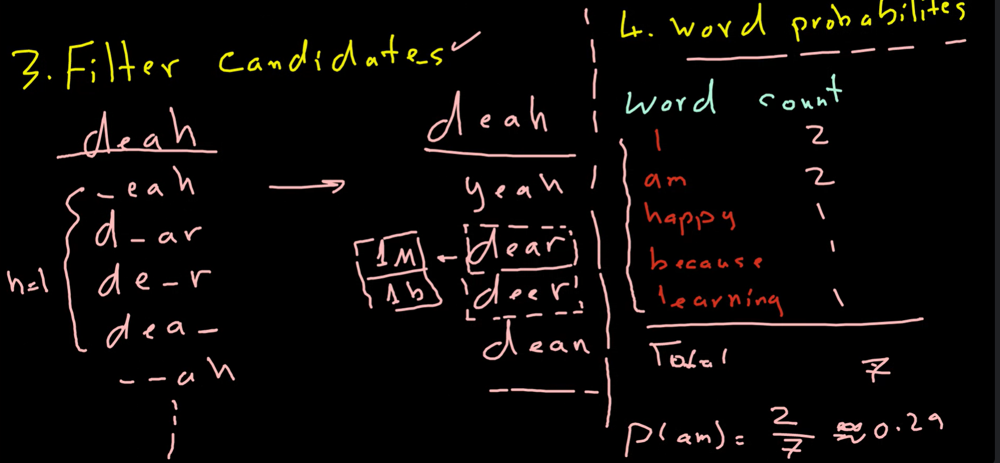

### Autocorrect in NLP: is a feature that corrects misspelled words in a text document. It is a very useful feature in search engines and text editors.
- #### Identify the misspelled words: for each word in the text, check if it is in the dictionary of words. If it is not, then it is a misspelled word. 
  ```python	
  for word in text:
    if word not in dictionary:
      misspelled_words.append(word)
  ```

- #### Find strings n edit distance away:  Edit: an operation performed an strings to change it. 
- #### Edit distance: the number of edits required to change one string to another.

- #### The operations of edit are:
  - #### Insertion: add a new character to a string. ex: "hat" -> "chat"
  - #### Deletion: remove a character from a string. ex: "hat" -> "at"
  - #### Switch: swap two consecutive characters in a string. ex: "hat" -> "aht"
  - #### Replace: replace a character in a string with a new character. ex: "hat" -> "cat"




