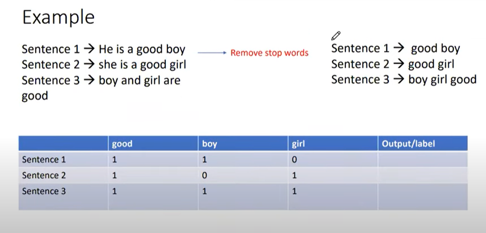

## __BOW:__
- ### it is a common technique used to represent text data numerically, wich is important for many NLP tasks such as text classification, culstering, and sentiment analysis.
- ###  The Bag of words model is a simple way to representing text data. it Involves creating a vocabulary of all the unique words present in the text corpus and the represnting each document as a vector of word counts. The order of words in the document us not considered, only thier frequency of occurrence. 

