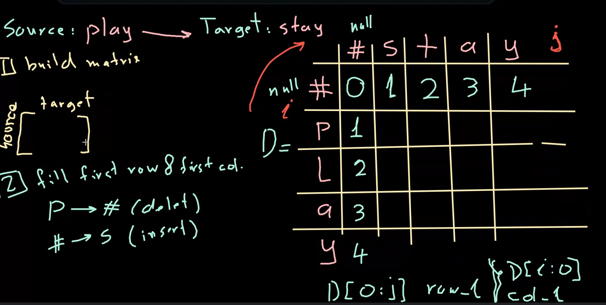

### Minimum Edit Distance (MED): Minimum Edit Distance is a measure used in natural language processing, computational biology, and various other disciplines to quantify the similarity between two strings (or sequences). It is defined as the minimum number of operations required to transform one string into the other. These operations usually include insertion, deletion, and substitution. Each of these operations is typically associated with a cost, and the aim is to find the sequence of operations with the minimum total cost.

#### For Example: 
- #### source = 'Play'
- #### Target = 'Stay' 

#### - Cost: 
- #### insert: 1
- #### Delete: 1
- #### replace: 2

1- P -> S
2- L -> t replace: 2 + 2 = 4. 

---- 
### Source: Play --> Target: Stay, to know the minimum between the 2 strings.

1. #### Bulid matrix.

'#' --> means  Null. 

2. #### Fill first row and first column.
p --> # (delete) cost: 1
'#' --> S (insert) cost: 1

