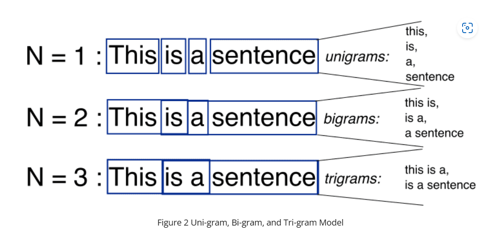

## ___N-grams:___ 
### are a type of graphical model used to capture patterns in sequential data such as text. An N-gram consists of a sequence of N items from a given text corpus. The items can be words, letters, or syllables. N-grams can be used to build language models that can be used for tasks such as speech recognition and machine translation.

- ### N-grams are combinations of words or letters that create a unit of meaning. They are used in natural language processing to help identify the context of words. N-grams can be unigrams (single words), bigrams (two words), trigrams (three words), or higher order n-grams.
- ### Unigrams are the simplest form of n-gram and are just singleton terms. Bigrams are two terms that occur together, such as “machine learning.” Trigrams are three terms that occur together, such as “learn deep learning.” Higher order n-grams are four or more terms that occur together.
- ### N-grams can be used for a variety of tasks in natural language processing, including text classification, topic modeling, speech recognition, and machine translation.
