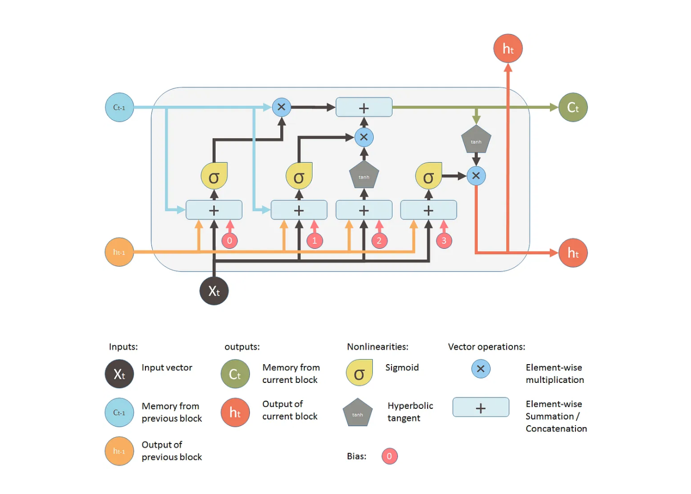

# Recurrent Neural Network

- ## Why not a standard  neural network?

 

### - Problems:
1. ### Input and output can be of different lengths in different examples.
2. ### Doesn't share features learned across different positions of text.

 

- ## What is a Recurrent Neural Network?
### is a special category of neural networks that allows information to flow in both directions. An RNN has short-term memory that enables it to factor previous input when producing output. The short-term memory allows the network to retain past information and, hence, uncover relationships between data points that are far from each other. RNNs are great for handling time series and sequence data such as audio and text.

 

 

- ## Forward Propagation:

 

- ## Simplified RNN Notation:

 

- ## Backpropagation Through Time:

- ### __Forward Propagation:__   This is the simplest type of neural network. Data flows only in forward direction from input layer to hidden layers to the output layer. It may contain one or more hidden layers. All the nodes are fully connected.We do forward propagation to get the output of the model and check its accuracy and get the error.

- ### __Backward Propagation:__  This is the most important step in the training of a neural network. In this step, we calculate the gradient of the error function with respect to the weights of the network. This is done by using the chain rule of differentiation. The weights are then updated using the gradient descent algorithm. This process is repeated until the error function is minimized.

 

- ## Defferent Types of RNN:
    1. ### One to One
    2. ### One to Many
    3. ### Many to One
    4. ### Many to Many

 

- ### One to One: This is the simplest type of neural network. Data flows only in forward direction from input layer to hidden layers to the output layer. It may contain one or more hidden layers. All the nodes are fully connected.We do forward propagation to get the output of the model and check its accuracy and get the error. (Tx = Ty = 1). It used to solve regular machine learning problems.

- ### One to Many: In this type of RNN, the input is a single vector and the output is a sequence. For example, image captioning. The input is an image and the output is a sequence of words. (Tx = 1, Ty > 1). It used to solve problems like image captioning.

- ### Many to One: In this type of RNN, the input is a sequence and the output is a single vector. For example, sentiment analysis. The input is a sequence of words and the output is a single vector that tells us if the sentiment is positive or negative. (Tx > 1, Ty = 1). It used to solve problems like sentiment analysis.

- ### Many to Many: In this type of RNN, the input is a sequence and the output is also a sequence. For example, machine translation. The input is a sequence of words in one language and the output is a sequence of words in another language. (Tx = Ty > 1). It used to solve problems like machine translation.

 

- ## What is language modeling?
### Language modeling is the task of assigning a probability to sentences in a language. Language models have many applications in natural language processing. They are used to calculate the probability of a sentence, to predict the next word in a sequence, to generate text (such as song lyrics), and to generate speech (including Google Assistant).

### - How to build a language model?
### We can build a language model using a Recurrent Neural Network. We will use a character-level RNN to build a language model. The input to the model will be a sequence of characters and the output will be the probability of the next character. We will train the model on a corpus of text and then use it to generate new text.

 

- ### Character-level RNN:
### A character-level RNN reads words as a series of characters - outputting a prediction and “hidden state” at each step, feeding its previous hidden state into each next step. We take the final prediction to be the output, i.e. which class the word belongs to.

------------------------------------------------------------

##  - Vanishing  and Exploding Gradient Problem:

- ### __Gredient:__ a gradient is a partial derivative with respect to its inputs. A gradient measures how much the output of a function changes, if you change the inputs a little bit. You can also think of a gradient as the slope of a function. Higher the gradient, steeper the slope and the faster a model can learn. If the slope is almost zero, the model stops to learn. A gradient simply measures the change in all weights with regard to the change in error.

 

- ### __Exploding Gradient:__ This issue occurs when the values of a gradient are too large and the model is unstable. This can be solved using following methods:
    1. ### Gradient Clipping.
    2. ### Identity Initialization.
    3. ### Truncated Backpropagation.

- ### __Vanishing Gradient:__  This issue occurs when the values of a gradient are too small and the model stops learning or takes way too long because of that. This can be solved using following methods:
    1. ### Weight Initialization.
    2. ### Choosing the right activation function.

### As we know, the gated RNN architecture has three gates which controls the flow of information in the network, namely:
#### 1- Input gate/Write Gate.
#### 2- Keep Gate/Forget Gate.
#### 3- Output Gate/Read Gate.

## Long Short Term Memory (LSTM):
### Which stand for Long Short-Term Memory is a type of RNN that uses special units in addition to standard units. LSTM units include a “memory cell” that can maintain information in memory for long periods of time. A set of gates is used to control when information enters the memory, when it’s output, and when it’s forgotten. This architecture lets them learn longer-term dependencies. LSTM is well-suited to classify, process and predict time series given time lags of unknown size and duration between important events. Relatively small LSTM networks can achieve state of the art results on challenging problems like speech recognition, language modeling, machine translation, image captioning and more.

 

### Any LSTM model has cell state and hidden state at any given time step t. Here the horizontal line indicates the cell state of the model which helps in preserving the information for a long time and hence the name long-term memory, whereas, the hidden state is a function of the cell state which is used while predicting shorter contexts.

 

### Cell State has three gates:
#### 1- Input gate/Write Gate.: The input gate adds information to the cell state.
#### 2- Keep Gate/Forget Gate.: The keep gate removes information that is no longer required by the model.
#### 3- Output Gate/Read Gate.: The output gate selects the information to be shown as output.

 

### Architecture of LSTM:

 

## Components of LSTMs:
### So the LSTM cell contains the following components

- ### Forget Gate “f” ( a neural network with sigmoid)
- ### Candidate layer “C"(a NN with Tanh)
- ### Input Gate “I” ( a NN with sigmoid )
- ### Output Gate “O”( a NN with sigmoid)
- ### Hidden state “H” ( a vector )
- ### Memory state “C” ( a vector)

Inputs to the LSTM cell at any step are Xt (current input) , Ht-1 (previous hidden state ) and Ct-1 (previous memory state).

Outputs from the LSTM cell are Ht (current hidden state ) and Ct (current memory state)

- ### Forget Gate: This gate decide which information is important and should be stored and which information to forget. It removes the non important information from neuron cell. This results in optimization of performance. This gate takes 2 input- one is the output generated by previous cell and other is input of current cell. Following required bias and weights are added and multiplied and sigmoid function is applied to the value. A value between 0 and 1 is generated and based on this we decide which information to keep. If value is 0 the forget gate will remove that information and if value is 1 then information is important and has to be remembered.

 

 

- ### Input Gate: This gate is used to add information to neuron cell. It is responsible of what values should be added to cell by using activation function like sigmoid. It creates an array of information that has to be added. This is done by using another activation function called tanh. It generates a values between -1 and 1. The sigmoid function act as a filter and regulate what information has to be added in cell.

 

- #### Output Gate: This gate is responsible for selecting important information from current cell and show it as output. It creates a vector of values using tanh function which ranges from -1 to 1. It uses previous output and current input as a regulator which also includes sigmoid function and decides which values should be shown as output.

 

## Gated Recurrent Units (GRU):
### In simple words, the GRU unit does not have to use a memory unit to control the flow of information like the LSTM unit. It can directly makes use of the all hidden states without any control. GRUs have fewer parameters and thus may train a bit faster or need less data to generalize. But, with large data, the LSTMs with higher expressiveness may lead to better results.

### They are almost similar to LSTMs except that they have two gates: reset gate and update gate. Reset gate determines how to combine new input to previous memory and update gate determines how much of the previous state to keep. Update gate in GRU is what input gate and forget gate were in LSTM. We don't have the second non linearity in GRU before calculating the outpu, .neither they have the output gate.

----------------------------------

 

## Bidirectional RNN:
### Bidirectional RNNs are based on the idea that the output at time t may not only depend on the previous elements in the sequence, but also future elements. For example, to predict a missing word in a sequence you want to look at both the left and the right context. Bidirectional RNNs are quite simple. They are just two RNNs stacked on top of each other. The output is then computed based on the hidden state of both RNNs.

 

