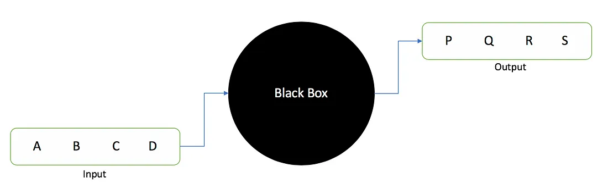
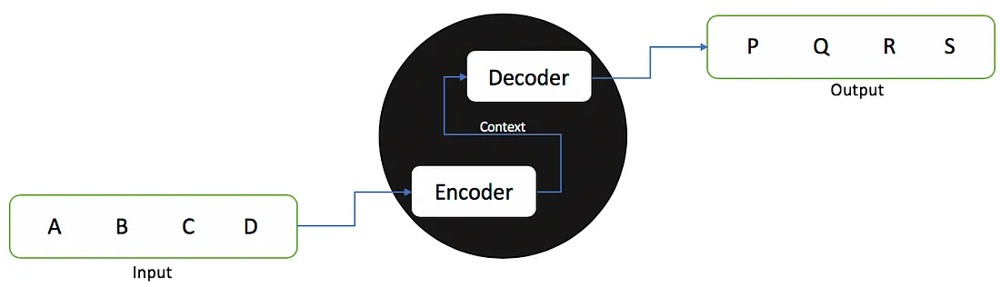
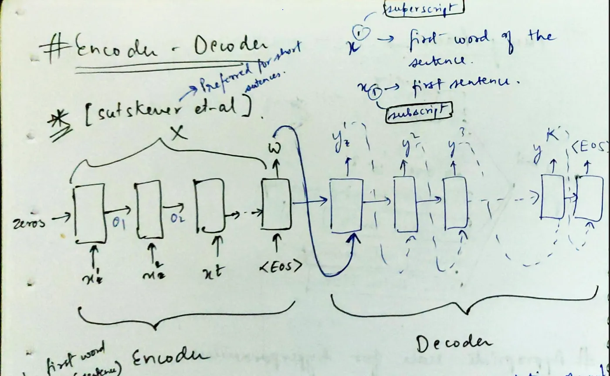
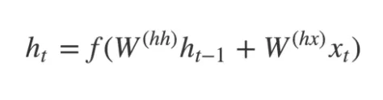
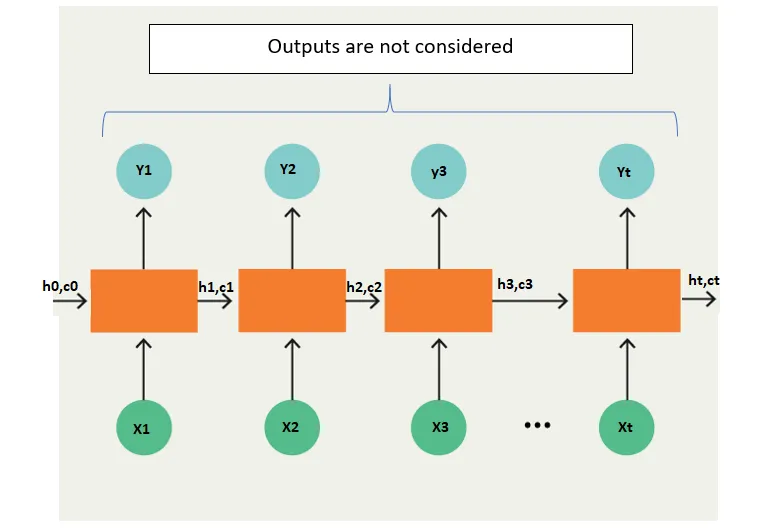
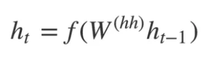
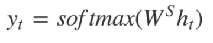
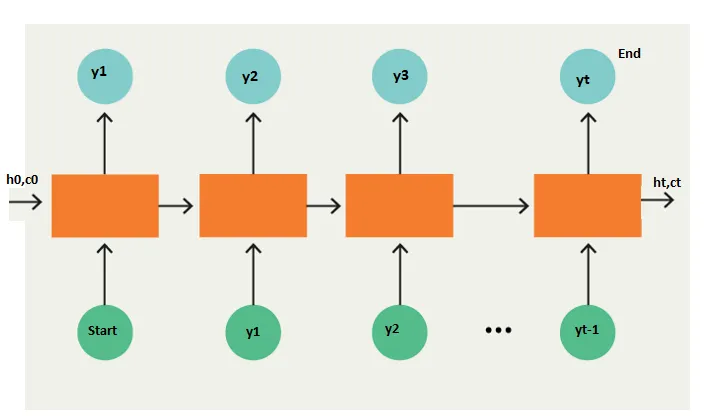
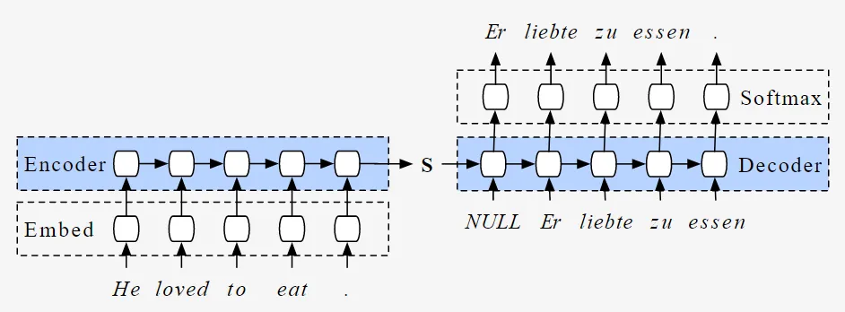

## SequenceToSequence:

### A Seq2Seq model is a model that takes a sequence of items (words, letters, time series, etc) and outputs another sequence of items.

 

### - In the case of Neural Machine Translation, the input is a series of words, and the output is the translated series of words.

 

### The model is composed of an encoder and a decoder. The encoder captures the context of the input sequence in the form of a hidden state vector and sends it to the decoder, which then produces the output sequence. Since the task is sequence based, both the encoder and decoder tend to use some form of RNNs, LSTMs, GRUs, etc. The hidden state vector can be of any size, though in most cases, it's taken as a power of 2 and a large number (256, 512, 1024) which can in some way represent the complexity of the complete sequence as well as the domain.

 

 

### Encoder-Decoder Architecture:

 

- ### __Encoder:__ 
### The encoder reads the input sequence and summarizes the information in something called the internal state vectors or context vector (in case of LSTM these are called the hidden state and cell state vectors). We discard the outputs of the encoder and only preserve the internal states. This context vector aims to encapsulate the information for all input elements in order to help the decoder make accurate predictions.

 

- ### __The hidden states h_i are computed using the formula:__

 

### The LSTM reads the data, one sequence after the other. Thus if the input is a sequence of length ‘t’, we say that LSTM reads it in ‘t’ time steps.

 

### __Xi__ = Input sequence at time step i.
### __hi and ci__ = LSTM maintains two states (‘h’ for hidden state and ‘c’ for cell state) at each time step. Combined together these are internal state of the LSTM at time step i.
### __Yi__ = Output sequence at time step i. Yi is actually a probability distribution over the entire vocabulary which is generated by using a softmax activation. Thus each Yi is a vector of size “vocab_size” representing a probability distribution.

 

### __Decoder:__

### The decoder is an LSTM whose initial states are initialized to the final states of the Encoder LSTM, i.e. the context vector of the encoder’s final cell is input to the first cell of the decoder network. Using these initial states, the decoder starts generating the output sequence, and these outputs are also taken into consideration for future outputs.

### A stack of several LSTM units where each predicts an output y_t at a time step t.
### Each recurrent unit accepts a hidden state from the previous unit and produces and output as well as its own hidden state.

 

### Any hidden state h_i is computed using the formula:

 

### The output at time step i is computed using the formula:

 

### We calculate the outputs using the hidden state at the current time step together with the respective weight W(S). Softmax is used to create a probability vector which will help us determine the final output (e.g. word in the question-answering problem).

 

### -  __Example:__

### **“START_ John is hard working _END”**

### The most important point is that the initial states (h0, c0) of the decoder are set to the final states of the encoder. This intuitively means that the decoder is trained to start generating the output sequence depending on the information encoded by the encoder.

### Finally, the loss is calculated on the predicted outputs from each time step and the errors are backpropagated through time in order to update the parameters of the network. Training the network over a longer period with a sufficiently large amount of data results in pretty good predictions.

 

###  - Overall Encoder-Decoder Architecture:
- ### During inference, we generate one word at a time.
- ### The initial states of the decoder are set to the final states of the encoder.
- ### The initial input to the decoder is always the START token.
- ### At each time step, we preserve the states of the decoder and set them as initial states for the next time step.
- ### At each time step, the predicted output is fed as input in the next time step.
- ### We break the loop when the decoder predicts the END token.