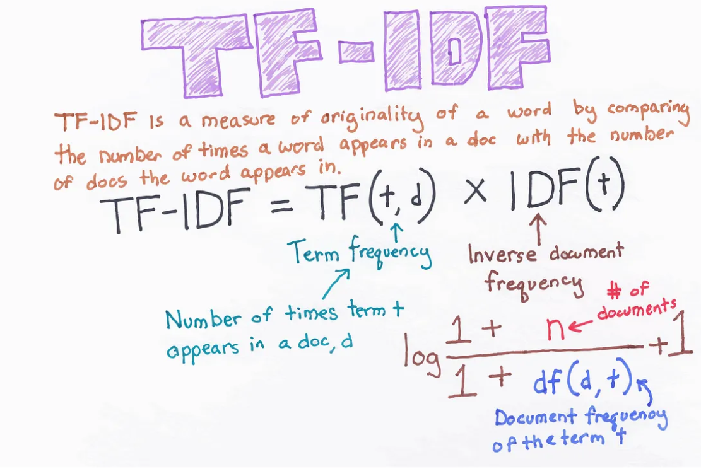
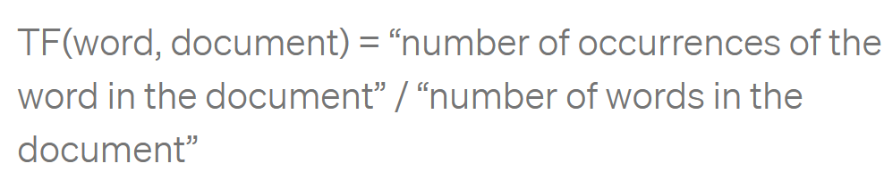
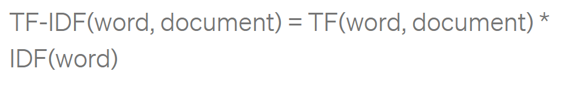

## __TF-IDF (Term Frequency-Inverse Document Frequency):__
###  is a way of measuring how relevant a word is to a document in a collection of documents.

### - This is done by multiplying two metrics:
- ### __Term Frequency (TF)__: how many times a word appears in a document.
- ### __Inverse Document Frequency (IDF)__: the inverse document frequency of the word across a collection of documents. Rare words have high scores, common words have low scores.

 

 

- ## How to compute TF-IDF:
### - Suppose we are looking for documents using the query Q and our database is composed of the documents D1, D2, and D3.
- ### Q: The cat.
- ### D1: The cat is on the mat.
- ### D2: My dog and cat are the best.
- ### D3: The locals are playing.

1. ### Compute the TF Scores:
    - ### TF(“the”, D1) = 2/6 = 0.33
    - ### TF(“the”, D2) = 1/7 = 0.14
    - #### TF(“the”, D3) = 1/4 = 0.25
    - ### TF(“cat”, D1) = 1/6 = 0.17
    - ### TF(“cat”, D2) = 1/7 = 0.14
    - ### TF(“cat”, D3) = 0/4 = 0

 

2. ### compute the TF-IDF scores of the words “the” and “cat”:
    - ### TF-IDF(“the”, D1) = 0.33 * 0 = 0
    - ### TF-IDF(“the, D2) = 0.14 * 0 = 0
    - ### TF-IDF(“the”, D3) = 0.25 * 0 = 0
    - ### TF-IDF(“cat”, D1) = 0.17 * 0.18= 0.0306
    - ### TF-IDF(“cat, D2) = 0.14 * 0.18= 0.0252
    - ### TF-IDF(“cat”, D3) = 0 * 0 = 0

 

3. ### To use a ranking function to order the documents according to the TF-IDF scores of their words.
 > ### ___NOTE:___ We can use the average TF-IDF word scores over each document to get the ranking of D1, D2, and D3 with respect to the query Q.

 

- ### Average TF-IDF of D1 = (0 + 0.0306) / 2 = 0.0153
- ### Average TF-IDF of D2 = (0 + 0.0252) / 2 = 0.0126
- ### Average TF-IDF of D3 = (0 + 0) / 2 = 0

 

> ### Looks like the word “the” does not contribute to the TF-IDF scores of each document. This is because “the” appears in all of the documents and thus it is considered a not-relevant word.

 

4. ### when performing the query “The cat” over the collection of documents D1, D2, and D3, the ranked results would be:
    ### a. D1: The cat is on the mat.
    ### b. D2: My dog and cat are the best.
    ### c. D3: The locals are playing.

 

