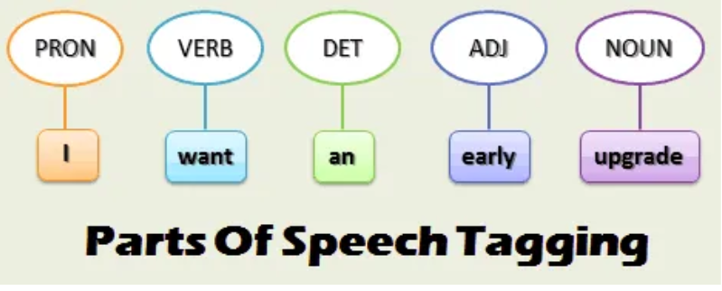

- ## __Parts of speech tagging:__ 
### is the process in which words in sentences are tagged with parts of speech. We all are familiar about parts of speech used in English language. Read a sentence and identifying which word is noun, adverb, conjuction, pronoun etc. Is also a fundamental task in natural language processing (NLP) that involves identifying the grammatical category of each word in a given text. There are several reasons why POS tagging is important in NLP:

1. ### __Parsing:__ POS tagging is a crucial step in syntactic parsing, which involves analyzing the structure of a sentence to determine its meaning. By identifying the part of speech of each word in a sentence, we can construct a parse tree that represents the syntactic structure of the sentence.
2. ### __Information retrieval:__ POS tagging can be used to improve the accuracy of information retrieval systems. By identifying the part of speech of a query term, we can narrow down the search space and retrieve only the relevant documents.
3. ### __Machine translation:__ POS tagging can be used to improve the accuracy of machine translation systems. By identifying the part of speech of each word in a sentence, we can generate more accurate translations that preserve the grammatical structure of the original sentence.
4. ### __Sentiment analysis:__ POS tagging can be used to improve the accuracy of sentiment analysis, which involves identifying the emotional tone of a piece of text. By identifying the part of speech of each word, we can identify words that are likely to carry sentiment and use them to predict the overall sentiment of the text.

