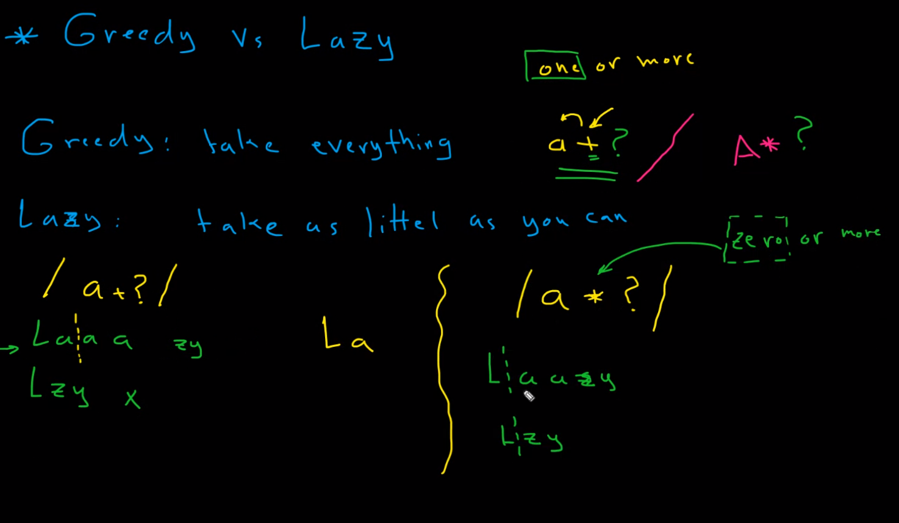

### - Greddy vs Lazy:
- ### Greedy: take everything it can.
- ### Lazy: take as little as possible. (?)

### Flags in regular expression:
- ### g: global: find all matches.
- ### i: ignore case.: case insensitive.
- ### m: multiline: match across multiple lines.
- ### s: single line.

### Special characters:
- ### $: end of a string.
- ### +: one or more.
- ### *: zero or more.
- ### ?: zero or one.
- ### ^: start of a string.
- ### []: matches one of the set of characters within [].
- ### [^]: matches anything not in the set of characters within [].
- ### .: any character except newline (\n).
- ### +?: one or more (lazy: taka as little as possible).

 

