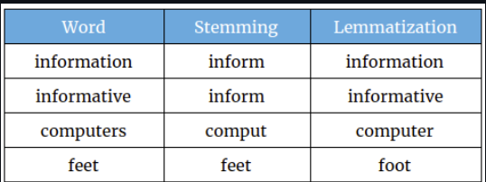

 ### __Lemmatization and Stemming:__ are Text Normalization techniques. These techniques are used to prepare words, text, and documents for further processing.
 
 1. ### __Stemming:__ is a natural language processing (NLP) technique used to reduce words to their root or base form, which is called the "stem." Stemming is commonly used as a pre-processing step in text mining and information retrieval tasks, such as document classification, clustering, and search engines.

- ### The stem is the part of the word that remains after removing any prefixes or suffixes. For example, the word "running" can be reduced to its stem "run" by removing the suffix "-ing". Similarly, the word "cats" can be reduced to its stem "cat" by removing the suffix "-s".

- ### Stemming algorithms use a set of rules or algorithms to perform this process automatically, based on linguistic principles and heuristics. There are several popular stemming algorithms, such as Porter Stemming Algorithm, Snowball Stemming Algorithm, and Lancaster Stemming Algorithm.

- ### The primary goal of stemming is to reduce the number of unique words in a corpus, while still preserving the core meaning of the text. This can improve the efficiency and accuracy of many NLP tasks, by reducing the number of distinct tokens that must be processed or analyzed.

 

2. ### __Lemmatization:__
- ### In Natural Language Processing (NLP), stemming and lemmatization are two commonly used techniques for reducing words to their base form. While both techniques aim to reduce the inflectional and derivational forms of words, they differ in their approach and the results they produce.

- ### Stemming is a process of reducing words to their base or root form by removing the suffixes from words. For example, the stemming algorithm might convert the words "running", "runners", and "run" to the base word "run". This technique is useful in cases where the context of the words is not important, such as in search engines, where stemming can help to retrieve documents that contain the root form of a word.

- ### Lemmatization, on the other hand, is a more sophisticated approach that involves identifying the morphological root of a word based on its context in a sentence. This technique takes into account the part of speech of a word and applies different normalization rules to different parts of speech. For example, the lemma of the word "am" is "be", while the lemma of the word "running" is "run".

- ### In stemming, for some words, it may not give may not give meaningful representation such as “Histori”. Here, lemmatization comes into picture as it gives meaningful word.

- ### Lemmatization takes more time as compared to stemming because it finds meaningful word/ representation. Stemming just needs to get a base word and therefore takes less time.

- ### Stemming has its application in Sentiment Analysis while Lemmatization has its application in Chatbots, human-answering.

### - In Python, there are several libraries that implement these techniques. The most popular libraries for stemming are Porter Stemmer and Snowball Stemmer, while the most popular library for lemmatization is WordNet Lemmatizer. 

