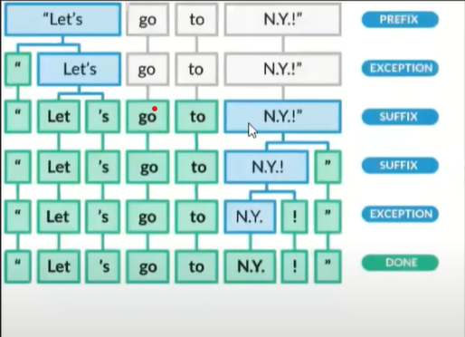

# Tokenization: 
 - ## is a way of separating a piece of text into smaller units called tokens. Here, tokens can be either words, characters, or subwords. Hence, tokenization can be broadly classified into 3 types – word, character, and subword (n-gram characters) tokenization.

- ### For example, let us consider “smarter”:
1. ### Character tokens: s-m-a-r-t-e-r
2. ### Subword tokens: smart-er

