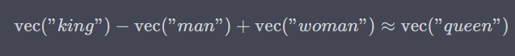
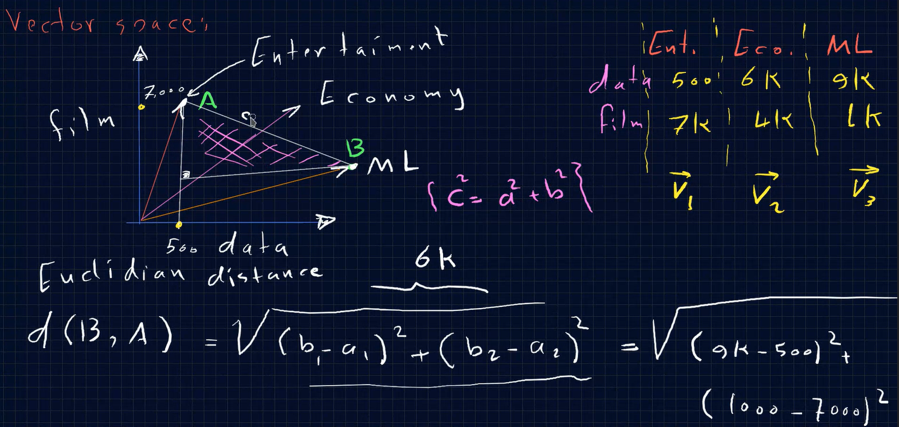
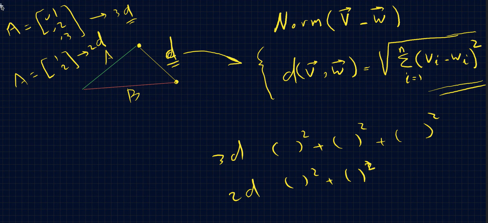
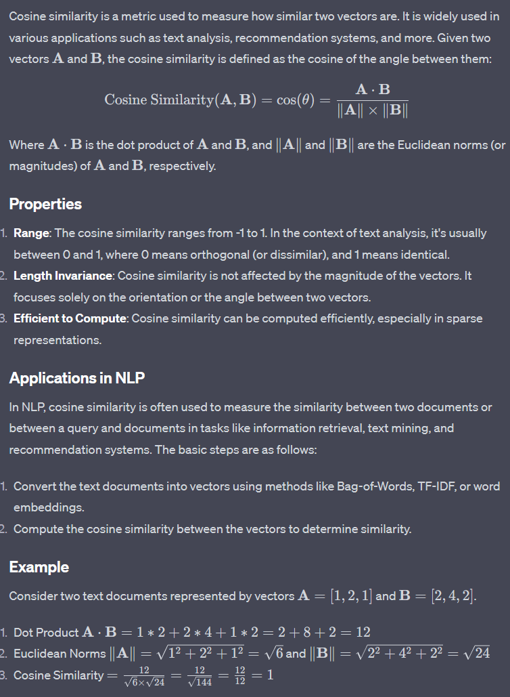
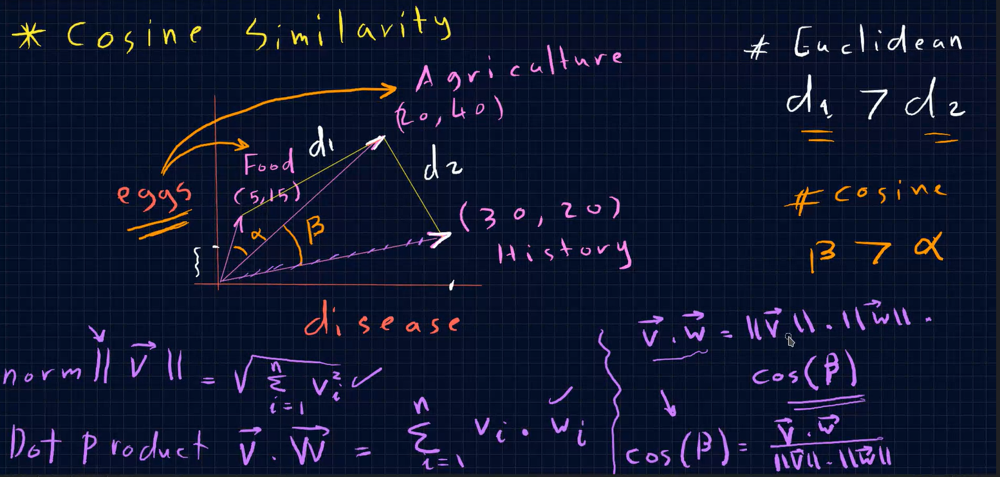
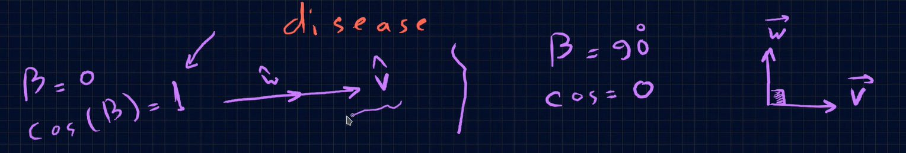
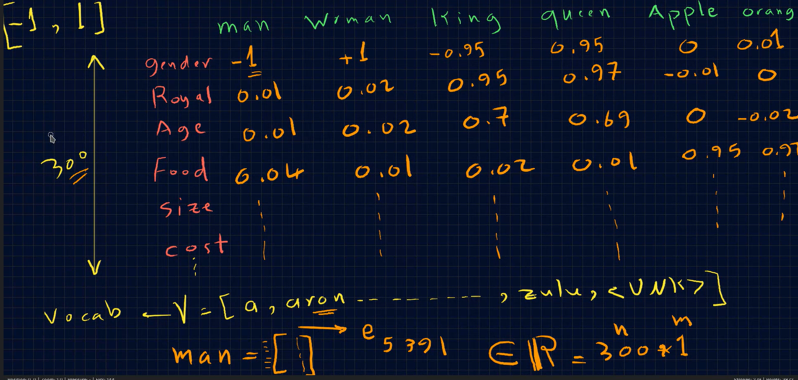
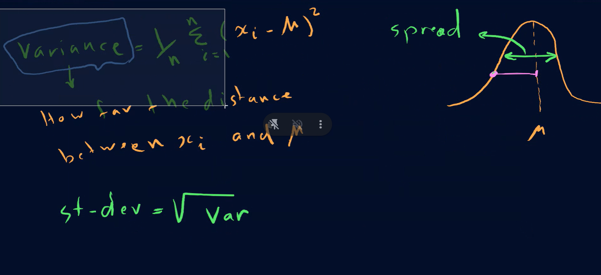
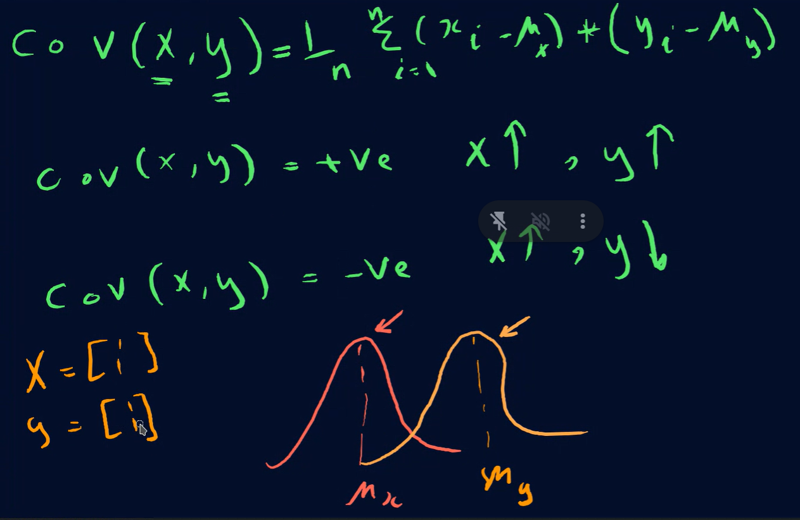

#### Vector space:  In Natural Language Processing (NLP), the concept of a vector space is used to represent and analyze text data. The idea is to transform words, phrases, sentences, or entire documents into vectors in a mathematical space, where semantic or syntactic relationships can be modeled as mathematical operations or geometric arrangements. Here's how vector spaces are commonly used in NLP:

1. #### Word Vectors: 
In word vector models like Word2Vec, GloVe, or FastText, each word in the vocabulary is associated with a high-dimensional vector. These vectors are trained in a way that words with similar meanings are closer to each other in the vector space. Operations like addition and subtraction can capture semantic relationships for example: 

1. #### Document Vectors

In some applications, it's useful to represent entire documents as vectors. Methods like TF-IDF (Term Frequency-Inverse Document Frequency), LSA (Latent Semantic Analysis), and Doc2Vec are used for this purpose.

3. #### Sentence Vectors

Sentences can also be represented in a vector space, often by averaging the word vectors of the words they contain or through more sophisticated methods like sequence models (RNNs, LSTMs) or Transformer-based models (BERT, GPT).

---

### 2. Cosine Similarity: 

--- 

### Word Embeddings:  is a type of word representation that captures semantic meanings, syntactic roles, and various other linguistic properties of words. In Natural Language Processing (NLP), word embeddings transform words into fixed-size vectors in a continuous vector space.

> gender have relation with king and queen but king is -1 and queen is 1, is -1 because is the opposite of, so the relation is the same but the direction is different. 

### Variance: is how much the punkt is spread out from the mean.

### Covariance is a statistical measure that helps to quantify the relationship between two variables. Specifically, it indicates the direction of the linear relationship between them. If the covariance is positive, it means that as one variable increases, the other variable tends to also increase. If the covariance is negative, it means that as one variable increases, the other tends to decrease. A covariance close to zero generally indicates that there is no linear relationship between the variables. 

