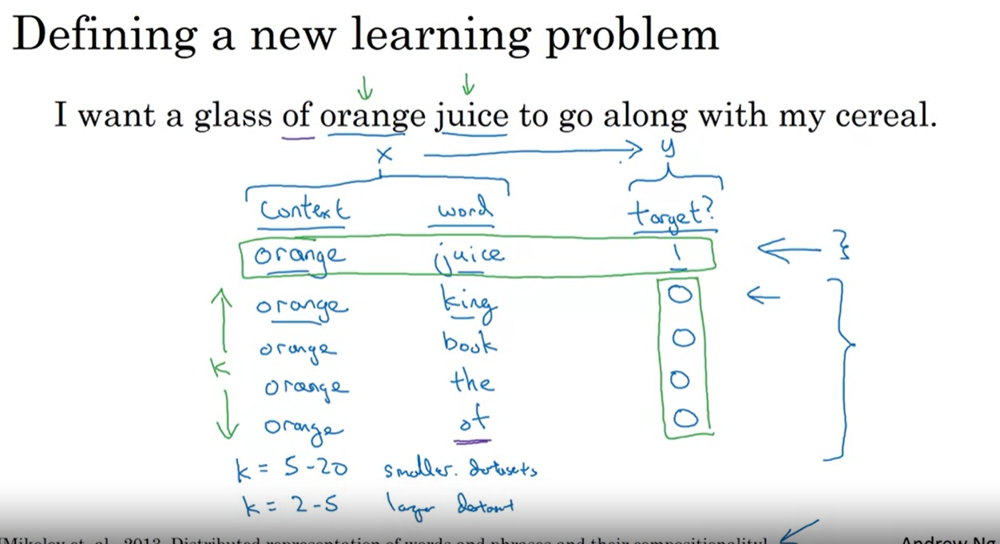
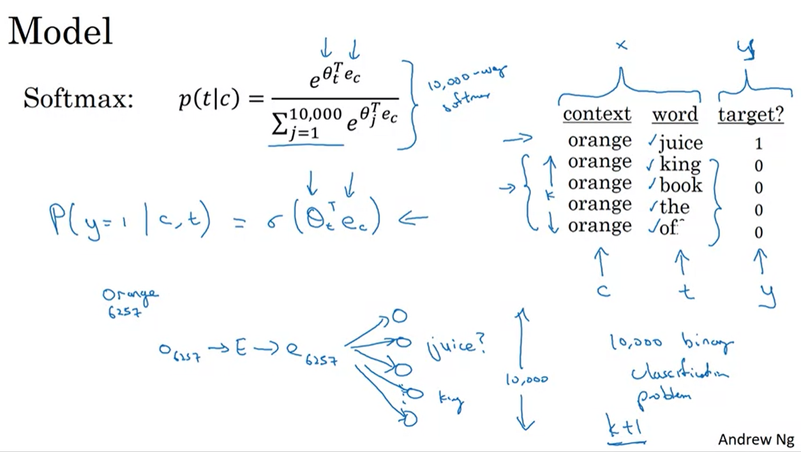

### Cosine similarity is a measure of similarity between two non-zero vectors of an inner product space that measures the cosine of the angle between them.

```
mathematically, it is defined as follows:
A.B = |A|.|B|.cos(theta) --> cos(theta) = A.B / |A|.|B| , where A.B is the dot product of A and B, |A| is the norm of A, |B| is the norm of B, theta is the angle between A and B.
norm of a vector is the length of the vector, mathematically, it is defined as follows: |A| = sqrt(A1^2 + A2^2 + ... + An^2) , where A1, A2, ..., An are the elements of the vector A.
for example:
A = [1, 2, 3]
B = [4, 5, 6]
A.B = 1*4 + 2*5 + 3*6 = 32
|A| = sqrt(1^2 + 2^2 + 3^2) = sqrt(14)
|B| = sqrt(4^2 + 5^2 + 6^2) = sqrt(77)
cos(theta) = 32 / (sqrt(14) * sqrt(77)) = 0.9746318461970762
```

-------------------------------

<br />

# Nagative Sampling in Word2Vec: 
### Negative sampling is a technique used in the training process of the Word2Vec algorithm to improve its efficiency and address the issue of computational complexity. Word2Vec is a popular algorithm for learning word embeddings, which are vector representations of words that capture their semantic and syntactic relationships.

### - In the skip-gram model of Word2Vec, the goal is to predict the context words given a target word. Negative sampling is a method introduced to make the training process more computationally efficient compared to the original hierarchical softmax approach.

### - In hierarchical softmax, the algorithm computes the probability of each word in the vocabulary being a context word for the target word, which requires evaluating the softmax function over the entire vocabulary. This computation can be computationally expensive, especially for large vocabularies.

### - Negative sampling addresses this issue by reframing the problem as a binary classification task. Instead of considering all words in the vocabulary as potential context words, negative sampling randomly samples a small number of "negative" words that are not contextually related to the target word. These negative samples are contrasted with the actual "positive" context words.

### - During training, for each training example, the algorithm randomly selects a few negative samples (typically around 5-20) from the vocabulary and treats them as negative examples, while the actual context words are treated as positive examples. The objective is then to correctly classify the positive examples as positive and the negative examples as negative.

### - By using negative sampling, Word2Vec avoids the computational overhead of evaluating the softmax function over the entire vocabulary and focuses only on a small number of positive and negative samples. This significantly speeds up the training process and makes it more scalable, particularly for large vocabularies.

### - The negative sampling technique is based on the assumption that words that are not contextually related to each other are more likely to be negatively sampled. By adjusting the frequency of negative sampling for different words based on their distribution in the training data, the Word2Vec model can effectively learn word embeddings that capture meaningful relationships between words.

<br />


