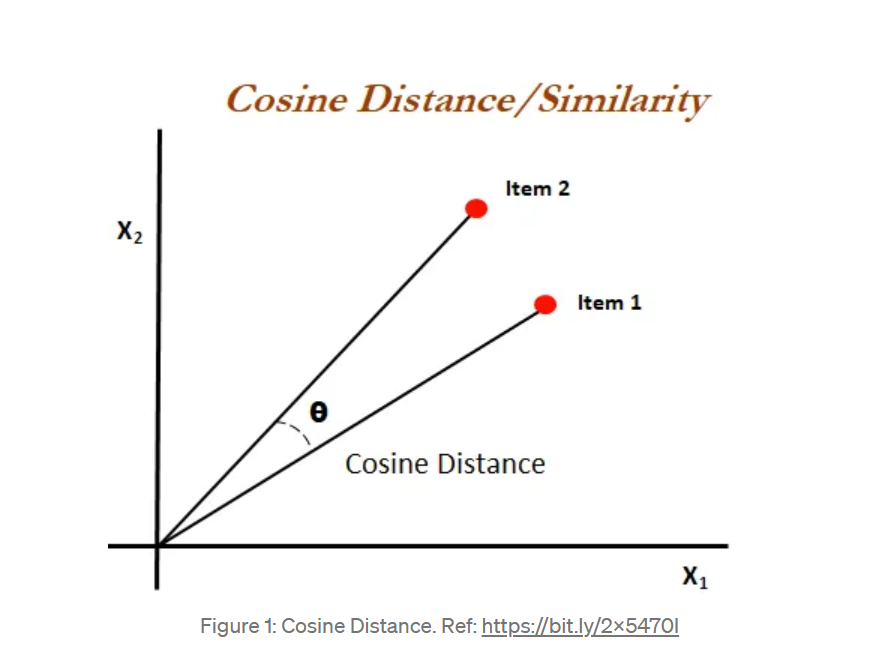
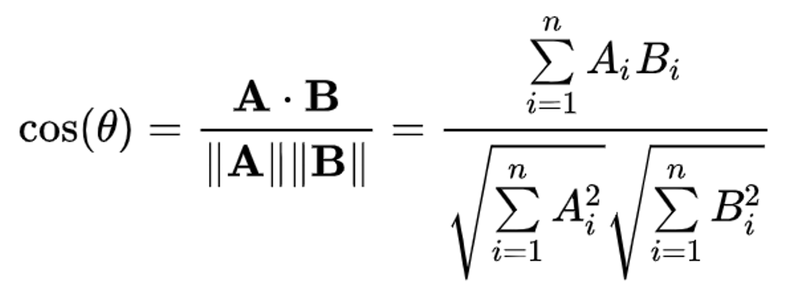
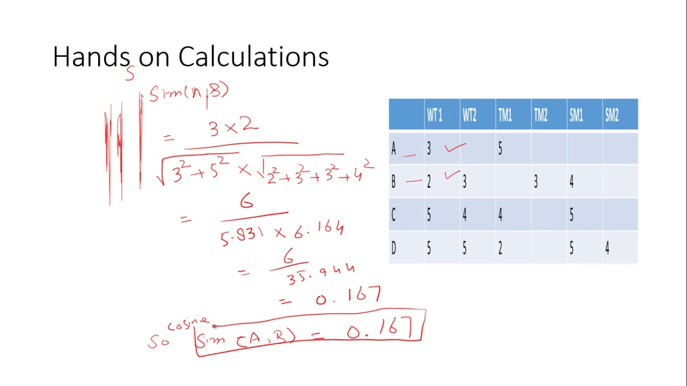
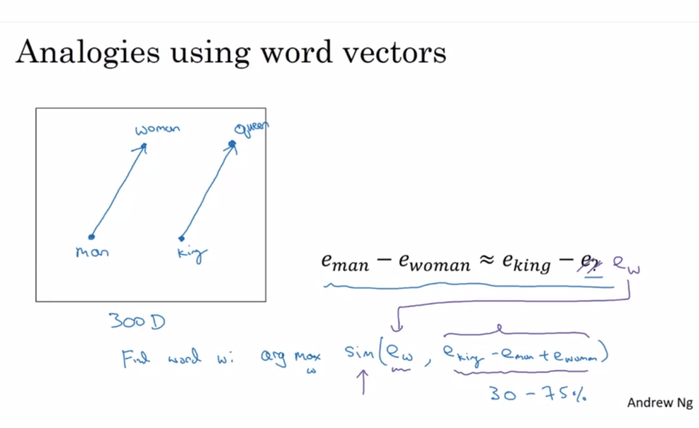
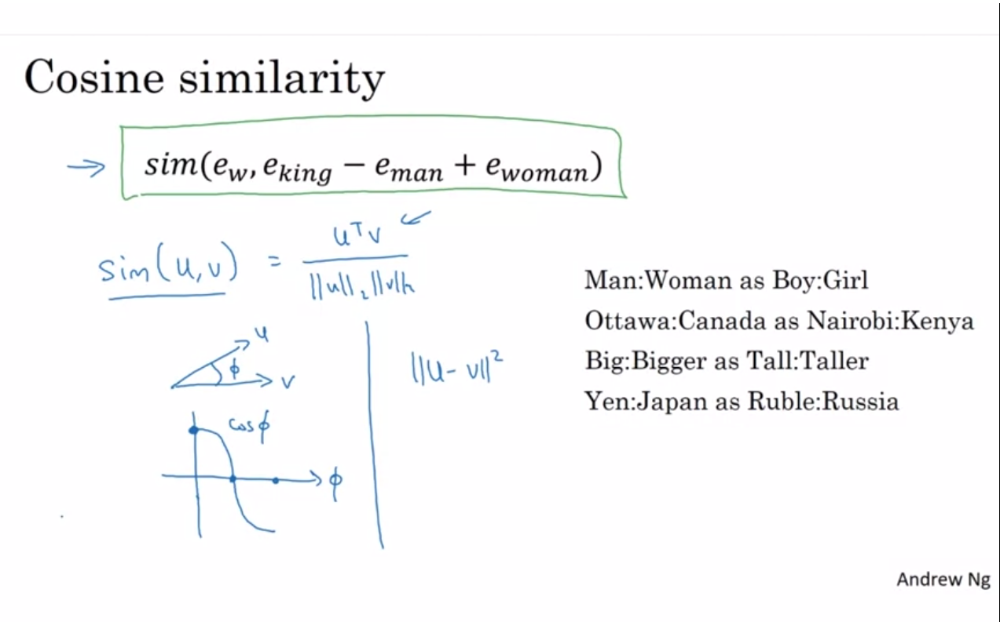

## Word Embedding
### In natural language processing, word embedding is used for the representation of words for Text Analysis, in the form of a vector that performs the encoding of the meaning of the word such that the words which are closer in that vector space are expected to have similar in mean.

### Word embeddings help in the following use cases: 
- Compute similar words
- Text classifications
- Document clustering/grouping
- Feature extraction for text classifications
- Natural language processing.

### Cosine Similarity:
- Cosine similarity is a metric used to measure how similar the documents are irrespective of their size. Mathematically, it measures the cosine of the angle between two vectors projected in a multi-dimensional space. It can be used to measure similarity between any two vectors. 

